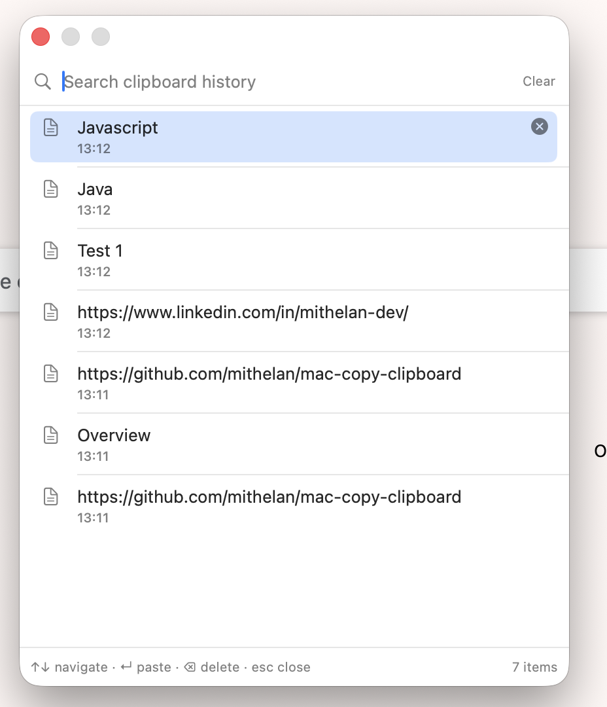
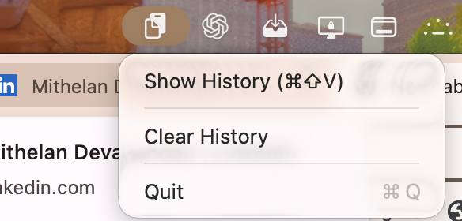

# Clipboard History

A tiny macOS menu bar app that keeps a running history of everything you copy
(text and images) plus screenshots you take, and lets you pick one to paste
by pressing **⌘⇧V** from anywhere.

- Runs as a menu bar icon only — no Dock icon, no windows until you invoke it.
- Watches the clipboard for text and images.
- Watches your screenshot folder (Desktop by default, or wherever
  `com.apple.screencapture`'s `location` is set) and adds new screenshots
  automatically, even if you never explicitly copy them.
- Press **⌘⇧V** to open a searchable popup of your last 10 items. Use
  ↑/↓ to navigate, **Enter** (or click) to copy the item and paste it
  straight into whatever app was frontmost, **Esc** to dismiss.
- Skips items marked "concealed"/"transient" by the copying app (e.g.
  password managers), so secrets don't end up in history.
- History persists across restarts in
  `~/Library/Application Support/ClipboardHistory/`. Only the 10 most
  recent items are kept — older ones are dropped automatically.

## Screenshots

| History panel (⌘⇧V) | Menu bar |
| --- | --- |
|  |  |

## Build

No Xcode installation required — just the Swift toolchain that ships with
Command Line Tools (`xcode-select --install` if you don't have it).

```bash
cd ClipboardHistory
./build.sh
```

This produces `ClipboardHistory.app` in this folder, ad-hoc signed, with the
app icon (`AppIcon.icns`) baked in. To regenerate the icon after tweaking its
design, edit `Icon/generate_icon.swift` and run:

```bash
swift Icon/generate_icon.swift Icon/AppIcon.iconset
iconutil -c icns Icon/AppIcon.iconset -o AppIcon.icns
```

> Note: `swift build` (Swift Package Manager) is broken on some
> Command-Line-Tools-only installs due to a manifest-linking bug unrelated to
> this app, so `build.sh` compiles the sources directly with `swiftc`
> instead. `Package.swift` is kept for reference/portability in case you have
> full Xcode installed, where `swift build` may work fine.

## Install & run

```bash
mv ClipboardHistory.app /Applications/
open /Applications/ClipboardHistory.app
```

The first time, Gatekeeper may warn about an unidentified developer since
it's ad-hoc signed — right-click the app and choose **Open** to bypass that
once.

To have it launch automatically at login: **System Settings → General →
Login Items** → add `ClipboardHistory.app`.

## Permissions

- **Accessibility (required for auto-paste)**: selecting an item simulates a
  ⌘V keystroke into the app you were just using, which macOS only allows for
  apps you've explicitly trusted. The first time you hit Enter/click an item,
  macOS will prompt you to grant this — approve it, then try again (that
  first attempt just copies to the clipboard since the permission isn't
  active yet). You can also grant it manually at **System Settings → Privacy
  & Security → Accessibility → Clipboard History**.
  - Because the app is only ad-hoc signed, **rebuilding it (`./build.sh`)
    changes its signature**, and macOS may ask you to re-grant Accessibility
    after each rebuild. This only affects development — a normal install
    doesn't get rebuilt.
- The global hotkey itself (⌘⇧V) does **not** need Accessibility — that part
  uses the Carbon Hot Key API, which works without it.
- **Screenshot folder access**: the first time it watches your screenshot
  folder, macOS may prompt for permission to access files there (e.g. the
  Desktop). Approve it, or grant it later at **System Settings → Privacy &
  Security → Files and Folders → Clipboard History**.

## Uninstall

Quit the app from the menu bar icon, then:

```bash
rm -rf /Applications/ClipboardHistory.app
rm -rf ~/Library/Application\ Support/ClipboardHistory
```
